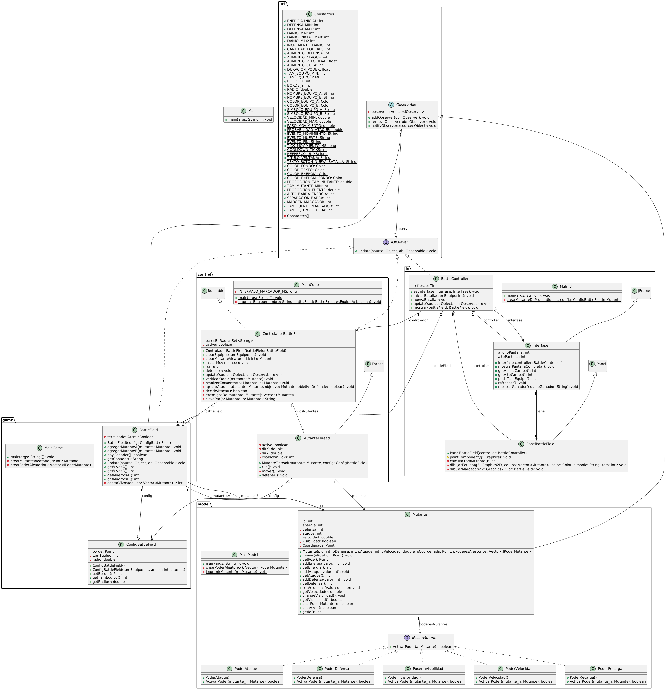

## Caso #1 - Mutant Battle


## Spec de los objetos

## Patrón Observer
IObserver <<interface>>

* Metodos:
  * update(Object source, Observable ob)

Observable <<abstract>>

* observers Vector < IObserver >
* Metodos:
  * addObserver(IObserver ob)
  * removeObserver(IObserver ob)
  * notifyObservers(Object source) → recorre la lista y llama ob.update(source, this)
  
## Model Layer

Cordenada
* x
* y

Mutante
* energia int
* defensa int
* ataque int
* cooldown time
* velocidad double
* visibilidad bool
* cordenadas Cordenada
* poderesMutantes Vector < PoderMutante >

* Metodos:
  * moverse(Cordenada posicion)
  * atacar(Mutante mutante)
  * defenderse(Mutante mutante)
  * usarPoderMutante()

PoderMutante
* Metodos:
     * activarPoder(Mutante mutante)

PoderDefensa
* aumentoDefensa int
* duracion float
* override: 
    * activarPoder(Mutante mutante)

PoderAtaque
* aumentoAtaque int
* duracion float
* override: 
    * activarPoder(Mutante mutante)

PoderInvisilidad:
* duracion float
* override: 
    * activarPoder(Mutante mutante)

PoderVelocidad
* duracion float
* aumentoVelocidad float
* override: 
    * activarPoder(Mutante mutante)

PoderCura
* aumentoCura int
* duracion float
* override: 
    * activarPoder(Mutante mutante)


## Gamer Layer
ConfiguracionBattleField (características)
* borde Cordenada
* tamEquipo int
* radio double
* Metodos:
  * getBorde()
  * getTamEquipo()
  * getRadio()

BattleField  
* borde Cordenada
* tamEquipo int
* mutantesA vector < Mutante >
* mutantesB vector < Mutante >
* Metodos:
  * crearEquipos(tamEquipo)
  * iniciarMovimiento()
  * verificarRadio()

## Control Layer
IObserver

* battleField BattleField
* hilosMutantes vector < MutanteThread >
* Metodos:
  * crearEquipos(tamEquipo)
  * iniciarMovimiento() → crea y arranca un MutanteThread por cada mutante
  * verificarRadio(Mutante mutante) → si un enemigo está dentro del radio, atacan o se defienden
  * run() → ciclo principal de la batalla hasta que haya un ganador
  detener()
  * update(Object source, Observable ob) → cada vez que un mutante se mueve, llama verificarRadio

MutanteThread extends Thread

* mutante Mutante
* activo bool
* Metodos:
  * run() → mientras el mutante esté vivo, se mueve y duerme el tiempo de su velocidad
  * detener()

## UI Layer (MVC)
* Model 
* View
* Controller
BattleController implements IObserver 
* controlador ControladorBattleField
* interfase Interfase
* Metodos:
  * iniciarBatalla(tamEquipo)
  * nuevaBatalla()

Interfase extends JFrame

* controller BattleController
* panel PanelBattleField
* Metodos:
  * Main(BattleField battleField)
  * refrescar()
  * mostrarGanador()

PanelBattleField extends JPanel

* Metodos:
  * paintComponent(Graphics g) → dibuja los mutantes, su equipo y  su energía

## Diagrama UML en PlantUML 
```
@startuml DiagramaMutantes
class Cordenada {
  - x : int
  - y : int
}
package "Model Layer" {
  class Mutante {
    - energia : int
    - defensa : int
    - ataque : int
    - velocidad : float
    - visibilidad : bool
    - cordenadas : Cordenada
    - cooldown : float
    - poderesMutantes : Vector<PoderMutante>
    --
    + moverse(posicion : Cordenada) : void
    + atacar(mutante : Mutante) : void
    + denfender(mutante : Mutante) : void
    + usarPoderMutante() : void
    .. Adders ..
    + addEnergia() : void
    + addDefensa() : void
    + addAtaque() : void
    + addVelocidad() : void
    + changeVisibilidad() : void
  }
  
  interface PoderMutante {
    + activarPoder(mutante : Mutante) : void
  }
  
  class PoderDefensa {
    {static} aumentoDefensa : int
    {static} duracion : float
    --
    + activarPoder(mutante : Mutante) : void
  }
  
  class PoderAtaque {
    {static} aumentoAtaque : int
    {static} duracion : float
    --
    + activarPoder(mutante : Mutante) : void
  }
  
  class PoderInvisibilidad {
    {static} duracion : float
    --
    + activarPoder(mutante : Mutante) : void
  }
  
  class PoderVelocidad {
    {static} aumentoVelocidad : float
    {static} duracion : float
    --
    + activarPoder(mutante : Mutante) : void
  }
  
  class PoderEnergia {
    {static} aumentoEnergia : int
    {static} duracion : float
    --
    + activarPoder(mutante : Mutante) : void
  }

}
package "Game Layer" {
  class BattleField {
    {static} borde : Cordenada
    - tamEquipo : int
    - mutantesA : Vector<Mutante>
    - mutantesB : Vector<Mutante>
    --
    + crearEquipos(tamEquipo : int) : void
    + iniciarMovimiento() : void
    + verificarRadio() : void
  }
}
package "UI Layer" {
  class Interfase {
    --
    + Main(BattleField battleField) : void
  }
  
  
}

' ---- Relaciones ----
Interfase --> BattleField
PoderMutante <|.. PoderDefensa
PoderMutante <|.. PoderAtaque
PoderMutante <|.. PoderInvisibilidad
PoderMutante <|.. PoderVelocidad
PoderMutante <|.. PoderEnergia

Mutante "1" *-- "1" Cordenada : cordenadas
Mutante "5" o-- "1*" PoderMutante : poderesMutantes

BattleField "1" *-- "1" Cordenada : borde
BattleField "11" o-- "3" Mutante : mutantesA
BattleField "11" o-- "3" Mutante : mutantesB

@enduml

```
